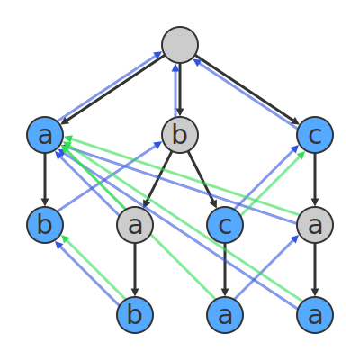

# Aho corasick

Aho Corasick is a linear time string searching algorithm. Lets start with the problem Description and its solution using Aho Corasick.

## Problem Description

Suppose you are given a master string of length N and a list of strings of length M ( 0< M <=N ) and you are required to find the strings in the list which are a substring of the master list.

A straightforward aproach would be to search for each string of list in the master string with a time complexity of O( N + M ) (KMP or Z method) making overall time complexity to be of O(N\*(length of list) + summation(M))

Aho Crosick is a linear time algorithm for this problem. Basically it is a modification of the Trie in which each node has a failure node which links to the node with same suffix.

<div style="text-align:center">

</div>

Consider the above Trie build for

```cpp
["a", "ab", "bab", "bc", "bca", "c", "caa"]
```

Here the green and blue arrows are the failure pointers which point to the node to go for in case of failure searching at this node. The green pointer specifically points to the node with that are the end of the words in the list.

Suppose the master string:

```cpp
string master = "abccab"
```

### The algorithm

- Mark all nodes (found) following the green link till we reach no green link i.e no dictionary suffix. Also mark the current node if this is the end of a dictionary element.

- Search for next character in the trie from current node.

  - In case of success move to the success node, increment the character pointer and go to step 1.
  - In case of failure move to the linked failure node following the blue pointer, go to step 1

### Dry Run

Initial State :

```cpp
Current Node =  root
Character Pointer = 0;
```

- As the root node has no `green` dictionary pointers and is not a dictionary end, we move to step 2.

  - Seaching for 'a' (`Character Pointer`) from the current node results into success and thus we increment the character pointer and move to node 'a' in first level.

```cpp
Current Node =  'a' in first level
Character Pointer = 1;
```

- We see no `green` dictionary pointer from this node and as this node is an end of a string we mark the string ending here as found. Move to step 2.

  - The search for character 'b' (`Character Pointer`) is success, we increment the character pointer and move to the node 'b' in second level.

```cpp
Current Node =  'b' in second level
Character Pointer = 2;
```

- We see no `green` dictionary pointer from this node and as this node is an end of a string we mark the string ending here as found. Move to step 2

  - The search for character 'c' (`Character Pointer`) is failure we move to the node 'b' in first level following the `blue` suffix pointer (Note that the character pointer is not incremented.)

```cpp
Current Node =  'b' in first level
Character Pointer = 2;
```

- We see no `green` dictionary pointer from this node and as this node is not end of a string we move to step 2.

  - The search for character 'c' (`Character Pointer`) is success, we increment the character pointer and move to the node 'c' in second level.

```cpp
Current Node =  'c' in second level
Character Pointer = 3;
```

- We see a `green` dictionary pointer from this node following the `green` dictionary pointers till the end we mark the string ending at the node 'c' in first level (ie "c" ) as found and as this node is also an end of a string we mark the string ending here (ie "bc") as found. Move to step 2.

  - The search for character 'c' (`Character Pointer`) is failure therefore we move to the node 'c' in first level following the `blue` suffix pointer (Note that the character pointer is not incremented.)

```cpp
Current Node =  second 'c' in first level
Character Pointer = 3;
```

- We see no `green` dictionary pointer from this node and as this already marked we move to step 2.

  - The search for character 'c' (`Character Pointer`) is failure therefore we move to the root node following the `blue` suffix pointer (Note that the character pointer is not incremented.)

```cpp
Current Node =  root node
Character Pointer = 3;
```

- As the root node has no `green` dictionary pointers and is not a dictionary end, we move to step 2.

  - Seaching for 'c' (`Character Pointer`) from the current node results into success and thus we increment the character pointer and move to node 'c' in first level.

```cpp
Current Node =  second 'c' in first level
Character Pointer = 4;
```

- As this already marked we directly move to step 2.

  - The search for character 'a' (`Character Pointer`) is success, we increment the character pointer and move to the node 'a' in second level.

```cpp
Current Node =  second 'a' in second level
Character Pointer = 5;
```

- We see a `green` dictionary pointer from this node following the `green` dictionary pointers we see that the node is already marked and as this node is not end of a string we move to step 2.

  - The search for character 'b' (`Character Pointer`) is failure therefore we move to the node 'a' in first level following the `blue` suffix pointer. (Note that the character pointer is not incremented)

```cpp
Current Node =  second 'a' in second level
Character Pointer = 6 (end);
```

- We see no `green` dictionary pointer from this node and as this already marked we move to step 2.

  - End of the string, we break out of the function.

Thus finally the found array

```cpp
["a", "ab", "bab", "bc", "bca", "c", "caa"]
[  1,    1,     0,   1,     0,   1,      0]
```

Time Complexity of this algorithm is O(N + sum(M))

Note: To find all the occurrences the string, the algorithm can be used with a O(N + sum(M) + Total no of occurrences of words in the string)

Which is quadratic in worst case

For example testcase

```cpp
master = "aaaa"
["a", "aa", "aaa", "aaaa" ]
```
